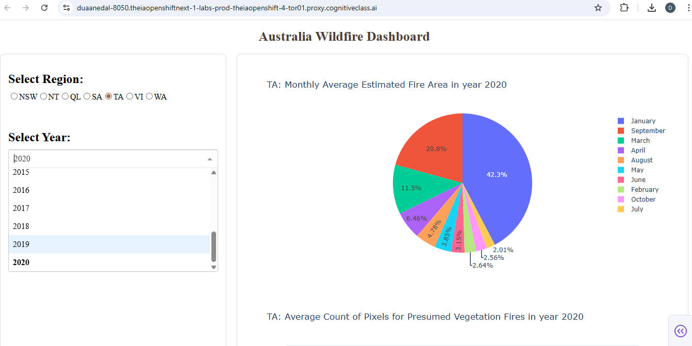

# Australia Wildfire Assignment 🔥

This repository contains the complete solution for the **Australia Wildfire Analysis and Dashboard Assignment**.

The assignment is divided into two main parts:
- **Part 1:** Data analysis and visualization
- **Part 2:** Interactive dashboard using Dash and Plotly

The dataset used contains historical wildfire data in Australia starting from 2005.

---

## 📂 Dataset Description

The wildfire dataset includes the following variables:

- **Region**: One of the 7 regions in Australia  
- **Date**: Date in UTC (24-hour period)  
- **Estimated_fire_area**: Daily sum of estimated fire area (km²) for presumed vegetation fires with confidence > 75%  
- **Mean_estimated_fire_brightness**: Daily mean fire brightness (Kelvin)  
- **Mean_estimated_fire_radiative_power**: Daily mean radiative power (MW)  
- **Mean_confidence**: Daily mean confidence level  
- **Std_confidence**: Standard deviation of fire radiative power  
- **Var_confidence**: Variance of fire radiative power  
- **Count**: Daily number of fire pixels with confidence > 75%  
- **Replaced**: Indicates whether data was replaced with higher-quality standard data  

---

## 📊 Part 1: Analyzing the Wildfire Activities in Australia

This part focuses on data analysis and visualization using Pandas, Matplotlib, Seaborn, and Folium.
The analysis is implemented in a Jupyter Notebook and can be viewed or executed directly using Google Colab.

👉 **Open the notebook in Google Colab:**  
[Wildfire_Australia.ipynb (Colab)](https://colab.research.google.com/github/duaabn/Wildfire-Australia/blob/main/Wildfire_Australia.ipynb)

### Tasks Completed
- Line plot of average estimated fire area over time
- Monthly analysis of estimated fire area
- Bar plot of mean estimated fire brightness across regions
- Pie chart showing distribution of fire pixel counts across regions
- Customized pie chart for improved visualization
- Histogram of mean estimated fire brightness
- Distribution of fire brightness across regions using Seaborn with hue
- Scatter plot showing correlation between mean estimated fire radiative power and mean confidence
- Map visualization of all seven regions in Australia using Folium


## 🖥️ Part 2: Interactive Dashboard (Dash & Plotly)

This part presents an interactive dashboard built using Dash and Plotly.
The dashboard allows users to select a **Region** and **Year** and dynamically updates the visualizations.

📄 **Dashboard source code:**  
[dash_wildfire.py](https://github.com/duaabn/Wildfire-Australia/blob/main/dash_wildfire.py)

## 📸 Dashboard Preview



### Dashboard Visualizations
- Pie Chart: Monthly Average Estimated Fire Area
- Bar Chart: Monthly Average Count of Pixels for Presumed Vegetation Fires


## ▶️ Run the Dashboard Locally

To run the dashboard locally, execute the following command:

```bash
python3.8 dash_wildfire.py
